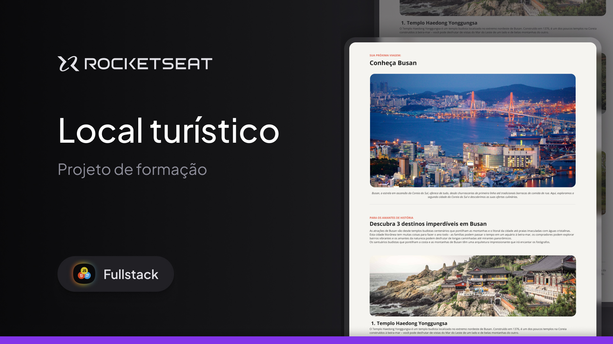

<h1 align="center">Local de Turísmo</h1>

Programa feito no quadro do curso Full-Stack da Rocketseat.  

 

  
  Imagem feita por <a href="https://www.linkedin.com/in/thielesantana/?originalSubdomain=br">Thiele Santana</a>

## 🚀 Tecnologias

Esse projeto foi desenvolvido com as seguintes tecnologias:

- HTML e CSS
- Git e Github
- Figma

## 🖥️ Projeto

Este projeto é uma página web desktop com informações sobre um local turístico. 
Esse é um dos desafios práticos da formação Fullstack, um de nossos conteúdos de especialização.
